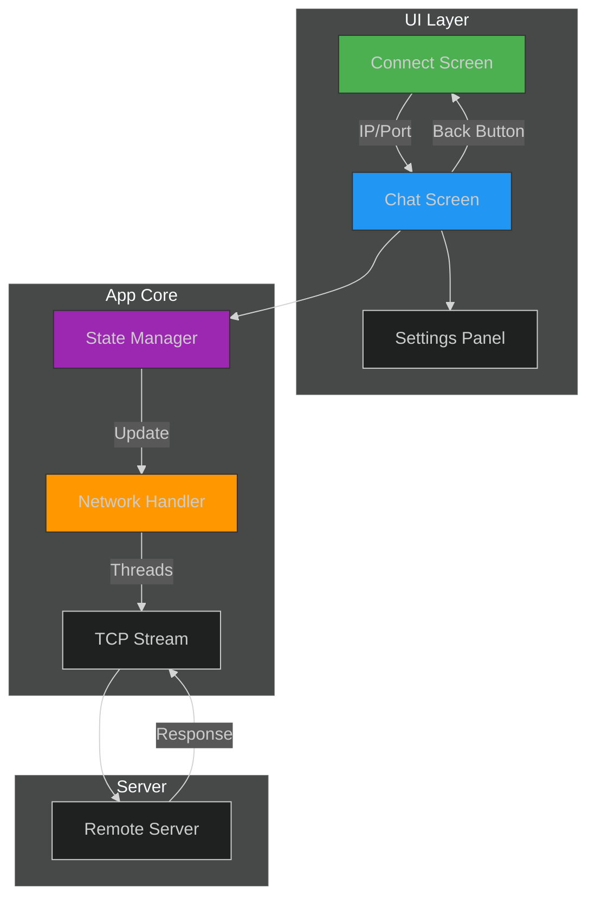

# Rust Chat Application  

A modern TCP chat client with GUI built in Rust using the `egui` framework.  

*Example: Connection and Chat Interface*

## Features ✨
- **GUI Interface** with egui/eframe
- **TCP Networking** with threaded I/O
- **Connection Management**  
  - IP/Port configuration
  - Error handling
  - Back button for connection reset
- **Real-Time Messaging**  
  - Message history with auto-scroll
  - Enter-to-send functionality
- **Modular Architecture**  
  - Isolated network layer
  - State-driven UI components

## Prerequisites 📦
- Rust 1.72+
- Cargo package manager
- TCP server (for testing: `nc -l 127.0.0.1 8080`)

## Installation ⚙️
```bash
git clone https://github.com/yourusername/rust-chat-app.git
cd rust-chat-app
cargo run --release 
```

## Usage 🖥️
### Connect to Server
- Enter server IP (default: 127.0.0.1)
- Enter port (default: 8080)
- Click Connect

### Chat Interface
- Type messages in bottom input
- Send with Enter or Send button
- History auto-updates

### Disconnect
- Click Back to reset connection
- Returns to connection screen

## Architecture Diagram 🗺️



**Key**:
- 🟢 **Green**: Connection interface  
- 🔵 **Blue**: Chat interface  
- 🟣 **Purple**: State controller  
- 🟠 **Orange**: Network module
